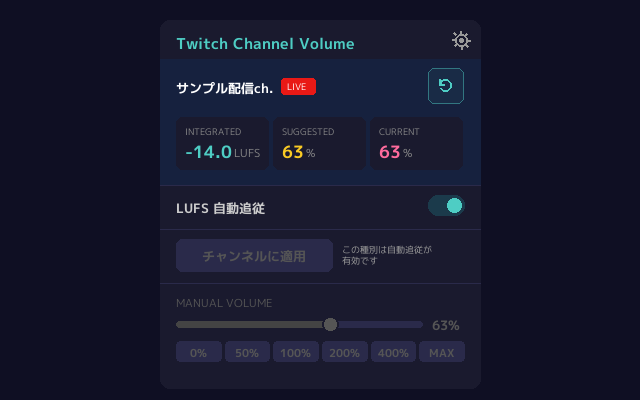
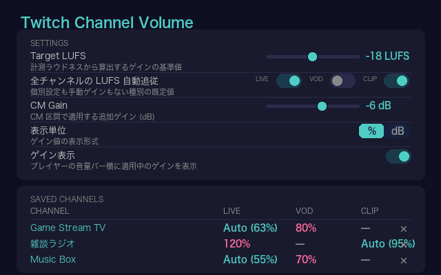
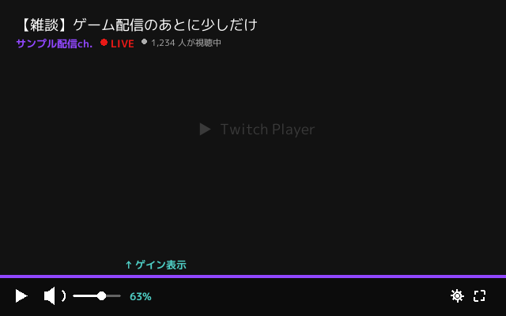

# Twitch Channel Volume

再生中の音声を **ITU-R BS.1770 LUFS** でリアルタイム計測し、Twitch のチャンネルごとの音量を自動調整する Chrome 拡張機能 (MV3)。CM 区間には別のゲインを適用する。

Twitch はラウドネスのメタデータを一切公開していない（`loudnessDb` 相当の API も HLS の音声メタデータもない）ため、本拡張機能は再生中の `<video>` を Web Audio API で直接計測し、算出したゲインをチャンネル × 種別（Live / VOD）ごとに保存する。クリップには手を触れない。

プレイヤーはメディアエンジンを Web Worker で動かし、これから再生する CM ごとに、その区間の範囲を要素自身のタイムラインで表した cue を
送出する。本拡張機能は `Worker` コンストラクタを包んでこの cue を受け取る。worker 自体はページが渡した引数のまま、手を加えずに生成する。
cue が届かない場合 — VOD のクライアントサイド広告 — は、ページ内のプレイヤーの CM 表示がその代わりになる。

> For the English version, see [README.md](README.md).

## スクリーンショット

`gen_screenshots.py` が拡張機能自身の配色と文言から描画したもので、Chrome ウェブストアの掲載画像と同じもの。

**ポップアップ** — Integrated ラウドネス、そこから算出した推奨ゲイン、適用中のゲイン、手動スライダー。



**設定画面** — ターゲットラウドネス、種別ごとの自動追従の既定値、CM 区間のゲイン、保存済みチャンネル。



**ゲイン表示** — プレイヤーの音量バー横に出す、適用中のゲイン。



## 機能

- **リアルタイム LUFS 計測**: Momentary (400 ms)・Short-term (3 秒)・Integrated (BS.1770 の絶対ゲートと相対ゲートを索引付きで更新)
- **チャンネルごとの LUFS 自動追従**: Live / VOD ごとに任意で有効化でき、計測した Integrated LUFS と Target LUFS に継続して追従する
- **測定値のリセット**: 現在の種別の計測履歴を破棄し、ゼロから再計測する。保存される値は再開後の最初のブロックから新しい計測に追従する。保存済みのゲインは変わらない
- **チャンネルごとの手動ゲイン**: Live / VOD の種別ごとにゲインを保存する。再訪時に自動適用され、Auto が計測を待っている間もこの値を使う
- **全体の Auto 既定値**: Live / VOD それぞれ独立した既定値を持ち、そのチャンネルの種別に明示的な Auto 設定も手動ゲインもない場合にだけ適用する
- **CM 区間の処理**: プレイヤーのメディアエンジンが送出する CM の cue と、ページ内のプレイヤーの CM 表示を読み取る。クライアントサイド広告は
  自身の要素で自身の音量で再生されるが、CM ゲインはその要素にも届く
- **クリップはそのまま再生する**: Twitch はクリップを CORS 外の別 origin から配信しており、そうした要素に対して Web Audio は無音を返すため、本拡張機能はクリップの音声経路に入らない。クリップにはゲインも Auto 設定も計測値も持たない
- **パイプラインの通知**: 状態ごとに「計測中」の表示を出し続ける代わりに専用のメッセージを出す — クリップのページである、他のスクリプトがプレイヤーの音声を既に握っている、メディアが別 origin から配信されている、オーディオコンテキストが起動しない、計測経路だけが立ち上がらなかった（最後の場合もゲインは適用される）。ポップアップはどれが起きたかと対処方法を示す
- **0–600 % のゲイン範囲**: Web Audio の `GainNode` による (HTML5 の `video.volume` では 1.0 が上限)
- **外部依存なし** — 素の JavaScript のみ、バンドラーなし

## 仕組み

```
<video>
  ├─→ MediaElementSource ─→ GainNode ─→ destination          (playback)
  └─→ MediaElementSource ─→ K-pre ─→ K-RLB ─→ AudioWorklet   (measurement)
                                              │
                                              └─→ port.postMessage
                                                  (per 100 ms mean-square)
```

計測経路は BS.1770-4 の K 特性（ハイシェルフのプリフィルタ + RLB ハイパス）を適用し、AudioWorklet で平均二乗を積算する。メインスレッドは 400 ms の Momentary と 3 秒の Short-term LUFS を集計する。Integrated LUFS は現在のチャンネルと種別の保存値から始め、その値が立っている計測窓の数 — 最短 30 秒、最長 3 分 — で重み付けするため、新しい計測が埋まるまでの間も、セッションが終わった時点のレベルが保たれる。1 時間分のリングバッファと平衡エネルギーインデックスが、絶対ゲートと相対ゲートの 2 段構成を保ったまま、保持している履歴を走査し直さずに各ブロックを対数時間で更新する。

## インストール

[Chrome ウェブストア](https://chromewebstore.google.com/detail/twitch-channel-volume/naieebjjbkfihkbcfkpcbjolckkiehmj) から導入する。

### デベロッパー モード

1. 本リポジトリを clone またはダウンロードする
2. `chrome://extensions/` を開く
3. **デベロッパー モード** を有効にする
4. **パッケージ化されていない拡張機能を読み込む** をクリックし、このフォルダを選択する

## 使い方

1. Twitch の配信・VOD を開く
2. 拡張機能アイコンをクリックし、現在の種別の **LUFS 自動追従** を有効にする
3. 計測が安定するにつれ、ゲインは現在の Integrated LUFS に追従し、Target LUFS へ近づける
4. **測定値をリセット** を使うと、現在の種別の計測履歴を破棄してゼロから再計測する
5. Auto を使わない場合は off のままにし、**チャンネルに適用** で現在の推奨ゲインを保存する
6. Auto が off の間は手動スライダー (0–600 %) を使う
7. CM 区間のゲインは設定画面で変更できる（既定値 −6 dB）

## 設定

- **Target LUFS**: ゲインの算出に使う基準ラウドネス (既定値 −18 LUFS、範囲 −30 〜 −6)
- **全チャンネルの LUFS 自動追従**: Live / VOD それぞれ独立した既定値 (既定はどちらも off)
- **CM Gain**: CM 区間で適用する追加ゲイン (既定値 −6 dB)
- **表示単位**: % または dB
- **ゲイン表示**: プレイヤーの音量スライダー横に適用中のゲインを表示する (既定は on)
- **保存済みチャンネル**: 最後に適用した Auto ゲインの一覧表示。削除・全削除ができる

## 開発

```sh
# テストの実行
node test.js

# Chrome が拒否する __pycache__ を作らずに Python の構文を確認する
python3 -B -c "import ast,pathlib; [ast.parse(p.read_text()) for p in pathlib.Path('.').glob('*.py')]"

# アイコンの再生成 (Pillow が必要)
python3 gen_icons.py

# 上のスクリーンショットの再描画 (Pillow が必要。書体は tools/fonts にある)
python3 gen_screenshots.py

# 追跡中のスクリーンショットとコードが描くものを、書き出さずに比較する
python3 gen_screenshots.py --check

# Chrome ウェブストア用 zip のビルド
python3 pack.py
```

展開した拡張機能のディレクトリで `python3 -m py_compile` を実行しないこと。Chrome が拒否する
`__pycache__` を作る。`node test.js` は拡張機能を読み込む前に、パッケージの元になるツリー —
`.git`・`node_modules`・ルート直下の作業用ディレクトリ `work` と `.claude` を除いたリポジトリ —
にアンダースコア始まりの予約パスがないかも確認する。この走査は `docs/` のように
パッケージ自体には含まれないファイルも対象にする。

## コンプレッサーで済ませない理由

静的なコンプレッサー（FrankerFaceZ のオプションなど）は大きなピークを潰すだけで、チャンネル間の*ラウドネスの中央値のずれ*には何もしない。本拡張機能は、YouTube が VOD に対して行っているのと同じく、チャンネル間で一定の Integrated ラウドネスを目標にする — Twitch はこれをサーバー側で行うことを拒んでいる。

## 背景

- Twitch は配信にも広告にもラウドネスノーマライゼーションを**行わない**
- チャンネル間のラウドネスの差は大きい（20 dB を超えることも多い）
- カリフォルニア州 SB 576（2026-07-01 施行）により、広告については変更を迫られる可能性がある
- 他の主要プラットフォームはノーマライズしている: YouTube (-14 LUFS)、Spotify (-14 LUFS)、Apple Music (-16 LUFS)

## プライバシー

- 外部へのネットワークリクエストを行わない。データはすべてデバイス上の `chrome.storage.local` に留まる
- 音声・映像データそのものは記録も送信もしない — 保存するのは算出した LUFS 値とゲイン設定だけ
- 詳細は [PRIVACY_POLICY.md](PRIVACY_POLICY.md)（[日本語](PRIVACY_POLICY_JA.md)）を参照

## ライセンス

MIT
